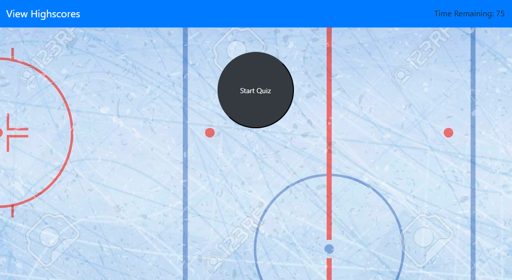

# Quiz

Created a quiz, using JavaScript, CSS, and HTML. The quiz has 5 questions and you have 75 seconds to answer the quesitons. Incorrect answers take 15 seconds off of the total time. Total time left after user has answered all the quesitons is the users score. If score is the high score, it will be stored locally.

# Quiz Topic

The topic of the quiz is NHL trivia questions.

# How to take Quiz

The quiz opens with a start button. Click on the button to begin. User will be asked one quesiton at a time. User answers a question by clicking on one of the four options. Clicking also moves on to the next question. After all questions are answered, users score is displayed. If user has the high score, user will be prompted to enter name for storage. Clicking on 'View Highscores' in the navbar will bring up the high score. Click close when done viewing the high score and user is taken back to the starting page and can take the quiz again if user wants to.

# Screenshots

